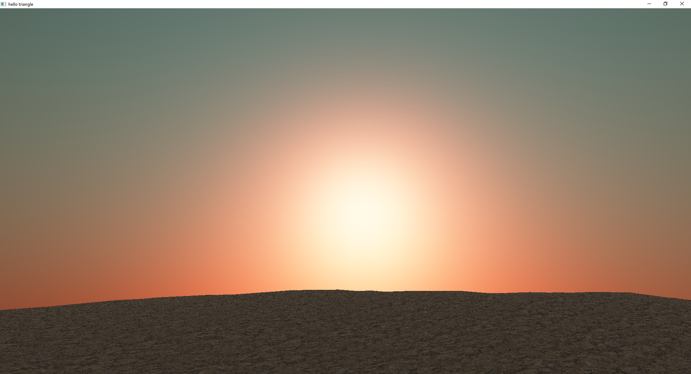

Atmospheric Scattering on a Procedurally Generated World
========================================

Project Description
------------

For this project I implemented atmospheric scattering with Rayleigh and Mie scattering on a procedurally generated landscape on a sphere in C++ using OpenGL. To learn more about the project and see demos please navigate [here.](<https://dane-reimers.github.io/AtmosScatteringOnProcGenWorld/>)
