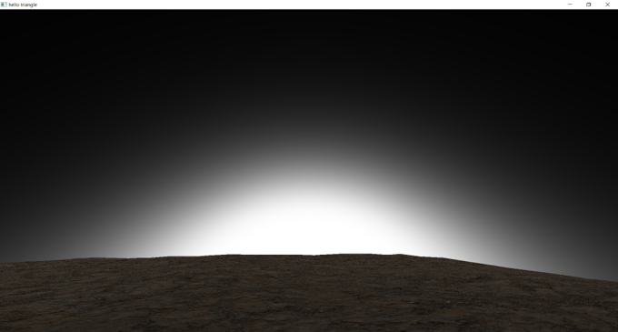

<html>
<head>
  <title>CSC 471 Atmospheric Scattering on Procedurally Generated Sphere</title>

  <link href="http://fonts.googleapis.com/css?family=Source+Sans+Pro:200,400,700,400italic,700italic" rel="stylesheet" type="text/css">

  
</head>

<body>
<section id="content">

<h1>Atmospheric Scattering on Procedurally Generated Sphere</h1>

<h4>Dane Reimers</h4>

<article> <!-- This adds padding at the top and bottom -->

<h3>Project Description</h3>

<pThis project is an implementation of atmospheric scattering, using both Rayleigh and Mie scattering, on a procedurally generated landscape on a sphere.

<!-- A Centered image-->

  
  <em>Screenshot of final product</em>

<h3>Landscape</h3>

I started the project by making the procedurally generated landscape on a sphere. To do this I started by rendering a large sphere centered at the origin. Then, with the vertex shader I used a noise function to scale the heights of the vertices along their normals to produce a terrain. I also used a dirt texture to make the terrain look more realistic and calculate the normals of each vertex by checking 2 close points to use in lighting the terrain.

  
  <em>Screenshot of the terrain with noise function in polygon mode</em>

  
  <em>Screenshot of the terrain</em>

<h3>Camera Movement</h3>

Another aspect of the project was creating a camera class that would work well on my spherical world. To do this I kept track of the "up" vector (which was the normalized position) and "lookAt" vector of the camera. 
    Each movement call, I first rotated the lookAt vector around the up vector by the amount of rotation from keyboard input. 
    Then, I calculated the cross product of the up vector and the lookAt vector to find a vector to use to create a rotation matrix that would move the camera in the direction of the lookAt vector. 
    Doing this created a camera that can look around the world and move in the direction it is facing, always staying at the planets surface.

  
   
  <em>Visual representation of camera vectors</em>

  <a>
    <video width=100% controls>
      <source src="images/camera.mp4" type="video/mp4">
    </video>
  </a>
  <em>Demo of camera movement</em>

<h3>Atmospheric Scattering</h3>

The last part of the project was to implement atmospheric scattering to create the sky for my world. 
    To create the effect I used a combination of Rayleigh and Mie scattering.
    Rayleigh scattering is the scattering of light waves by particles much smaller than the wavelength and produces the 
    blue color of the sky during the day and the orange/red at sunset. Mie scattering is the scattering of light by particles of
    similar or greater size than the wavelength (ex. aerosols) and produces the glow around the sun.
    You can read more about these effects <a href="https://developer.nvidia.com/gpugems/GPUGems2/gpugems2_chapter16.html">here</a>.
    First, I rendered another sphere centered at the origin that contained the planet sphere. 
    Then, I refactored code from <a href="https://github.com/wwwtyro/glsl-atmosphere">here</a> to perform the scattering on the outer sphere.
    I also added stars to the night sky by linearly interpolating between the atmospheric scattering and an image of stars.

<h4>Examples of only Mie Scattering</h4>
  

<h4>Examples of only Rayleigh Scattering</h4>
  

<h4>Stars</h4>
  

<h3>Final Product</h3>

Here are some demonstrations of the final product.

  <a>
    <video width=100% controls>
      <source src="images/final1.mp4" type="video/mp4">
    </video>
  </a>

 

  <a>
    <video width=100% controls>
      <source src="images/final2.mp4" type="video/mp4">
    </video>
  </a>

  <a>
    <video width=100% controls>
      <source src="images/final3.mp4" type="video/mp4">
    </video>
  </a>

 

<h4>Functionality</h4>
  <ul>
    <li>A and D keys rotate the camera on a plane tangent to the planet.</li>
    <li>W and S keys move the camera forward and backward</li>
    <li>J and K keys adjust the camera height up and down</li>

<h3>Resources</h3>
<ul>
  <li>
    <a href="https://github.com/Dane-Reimers/AtmosScatteringOnProcGenWorld">Github Link</a>
  </li>
  <li>
    Contact Email: Dane.Reimers@gmail.com
  </li>
</ul>

</article></section>
</body></html>
